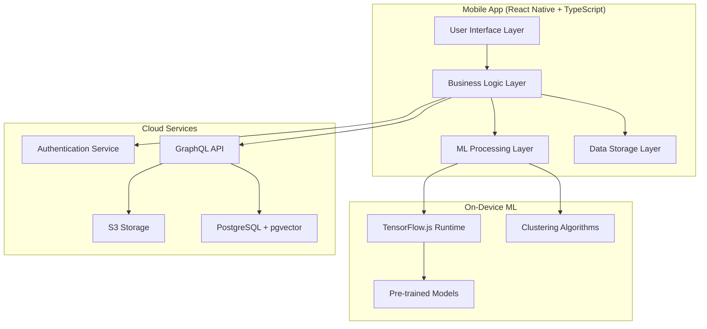

# Design Document

## Overview

The AI Photo Curator is a React Native mobile application that leverages on-device machine learning to intelligently organize, curate, and enhance photo collections. The app follows a privacy-first approach with all AI processing happening locally, while providing optional cloud synchronization for cross-device access. The architecture emphasizes performance, user experience, and scalability through a TypeScript-first approach and modern mobile development practices.

## Architecture

### High-Level Architecture



### Technology Stack

- **Frontend**: React Native with TypeScript, React Native Reanimated, React Native Skia
- **State Management**: Zustand for global state, React Context for component-level state
- **On-Device ML**: TensorFlow.js with hardware acceleration (Core ML/NNAPI)
- **Backend**: NestJS with TypeScript, GraphQL API
- **Database**: PostgreSQL with pgvector extension for embeddings
- **Storage**: Amazon S3 for image storage
- **Authentication**: JWT-based authentication
- **Deployment**: Serverless architecture (AWS Lambda/Vercel)

## Components and Interfaces

### Core Components

#### 1. Photo Import Service
```typescript
interface PhotoImportService {
  importFromCameraRoll(): Promise<Photo[]>
  importFromGooglePhotos(credentials: GoogleCredentials): Promise<Photo[]>
  importFromiCloud(credentials: iCloudCredentials): Promise<Photo[]>
  validatePermissions(source: PhotoSource): Promise<boolean>
}
```

#### 2. AI Analysis Engine
```typescript
interface AIAnalysisEngine {
  extractFeatures(photo: Photo): Promise<ImageFeatures>
  detectFaces(photo: Photo): Promise<Face[]>
  analyzeQuality(photo: Photo): Promise<QualityScore>
  analyzeComposition(photo: Photo): Promise<CompositionScore>
  analyzeContent(photo: Photo): Promise<ContentScore>
}
```

#### 3. Clustering Service
```typescript
interface ClusteringService {
  clusterByVisualSimilarity(photos: Photo[]): Promise<PhotoCluster[]>
  clusterByFaces(faces: Face[]): Promise<PersonCluster[]>
  clusterByTimeAndLocation(photos: Photo[]): Promise<EventCluster[]>
  mergeClusters(cluster1: PhotoCluster, cluster2: PhotoCluster): PhotoCluster
}
```

#### 4. Curation Engine
```typescript
interface CurationEngine {
  rankPhotos(cluster: PhotoCluster, goal: CurationGoal): Promise<RankedPhoto[]>
  selectBestShots(cluster: PhotoCluster, count: number): Promise<Photo[]>
  learnFromUserFeedback(feedback: UserFeedback): Promise<void>
  updateCurationWeights(goal: CurationGoal): Promise<void>
}
```

#### 5. Photo Editor
```typescript
interface PhotoEditor {
  removeBackground(photo: Photo): Promise<EditedPhoto>
  enhancePhoto(photo: Photo): Promise<EditedPhoto>
  suggestCrop(photo: Photo): Promise<CropSuggestion>
  applyFilters(photo: Photo, filters: Filter[]): Promise<EditedPhoto>
}
```

#### 6. Sync Service
```typescript
interface SyncService {
  uploadCuratedPhotos(photos: Photo[]): Promise<void>
  downloadUserLibrary(): Promise<Photo[]>
  syncMetadata(metadata: PhotoMetadata[]): Promise<void>
  resolveConflicts(conflicts: SyncConflict[]): Promise<void>
}
```

### Data Models

#### Photo Model
```typescript
interface Photo {
  id: string
  uri: string
  metadata: PhotoMetadata
  features?: ImageFeatures
  qualityScore?: QualityScore
  compositionScore?: CompositionScore
  contentScore?: ContentScore
  clusterId?: string
  faces?: Face[]
  edits?: PhotoEdit[]
  syncStatus: SyncStatus
  createdAt: Date
  updatedAt: Date
}

interface PhotoMetadata {
  width: number
  height: number
  fileSize: number
  format: string
  exif?: ExifData
  location?: GeoLocation
  timestamp: Date
}
```

#### AI Analysis Models
```typescript
interface ImageFeatures {
  embedding: number[]
  dominantColors: Color[]
  objects: DetectedObject[]
  scenes: DetectedScene[]
}

interface QualityScore {
  overall: number
  sharpness: number
  exposure: number
  colorBalance: number
  noise: number
}

interface CompositionScore {
  overall: number
  ruleOfThirds: number
  leadingLines: number
  symmetry: number
  subjectPlacement: number
}

interface ContentScore {
  overall: number
  faceQuality: number
  emotionalSentiment: number
  interestingness: number
}
```

#### Clustering Models
```typescript
interface PhotoCluster {
  id: string
  type: ClusterType
  photos: Photo[]
  centroid: number[]
  confidence: number
  label?: string
  createdAt: Date
}

interface PersonCluster {
  id: string
  name?: string
  faces: Face[]
  photos: Photo[]
  confidence: number
}

interface EventCluster {
  id: string
  name?: string
  photos: Photo[]
  timeRange: TimeRange
  location?: GeoLocation
  confidence: number
}
```

## Error Handling

### Error Categories

1. **Network Errors**: Handle offline scenarios gracefully
2. **Permission Errors**: Guide users through permission requests
3. **Storage Errors**: Manage device storage limitations
4. **ML Processing Errors**: Fallback strategies for failed AI analysis
5. **Sync Errors**: Conflict resolution and retry mechanisms

### Error Handling Strategy

```typescript
interface ErrorHandler {
  handleNetworkError(error: NetworkError): Promise<void>
  handlePermissionError(error: PermissionError): Promise<void>
  handleStorageError(error: StorageError): Promise<void>
  handleMLError(error: MLError): Promise<void>
  handleSyncError(error: SyncError): Promise<void>
}

// Global error boundary for React components
class GlobalErrorBoundary extends React.Component {
  // Error boundary implementation
}

// Service-level error handling
class ServiceErrorHandler {
  async retryWithBackoff<T>(
    operation: () => Promise<T>,
    maxRetries: number = 3
  ): Promise<T> {
    // Exponential backoff retry logic
  }
}
```

## Testing Strategy

### Testing Pyramid

#### Unit Tests (70%)
- Individual component testing
- Service layer testing
- Utility function testing
- ML model output validation

#### Integration Tests (20%)
- Component integration testing
- Service integration testing
- API integration testing
- Database integration testing

#### End-to-End Tests (10%)
- Critical user journey testing
- Cross-platform compatibility testing
- Performance testing

### Testing Tools and Frameworks

```typescript
// Jest configuration for unit testing
module.exports = {
  preset: 'react-native',
  setupFilesAfterEnv: ['<rootDir>/src/test/setup.ts'],
  testMatch: ['**/__tests__/**/*.test.ts', '**/__tests__/**/*.test.tsx'],
  collectCoverageFrom: [
    'src/**/*.{ts,tsx}',
    '!src/**/*.d.ts',
    '!src/test/**/*'
  ],
  coverageThreshold: {
    global: {
      branches: 80,
      functions: 80,
      lines: 80,
      statements: 80
    }
  }
}

// Detox configuration for E2E testing
module.exports = {
  testRunner: 'jest',
  runnerConfig: 'e2e/config.json',
  configurations: {
    'ios.sim.debug': {
      binaryPath: 'ios/build/Build/Products/Debug-iphonesimulator/PhotoCurator.app',
      build: 'xcodebuild -workspace ios/PhotoCurator.xcworkspace -scheme PhotoCurator -configuration Debug -sdk iphonesimulator -derivedDataPath ios/build',
      type: 'ios.simulator',
      device: {
        type: 'iPhone 14'
      }
    }
  }
}
```

### ML Model Testing

```typescript
interface MLModelTester {
  testImageFeatureExtraction(testImages: TestImage[]): Promise<TestResult>
  testFaceDetection(testImages: TestImage[]): Promise<TestResult>
  testQualityAnalysis(testImages: TestImage[]): Promise<TestResult>
  validateModelPerformance(model: MLModel, benchmarks: Benchmark[]): Promise<PerformanceReport>
}

// Performance benchmarks for ML models
interface Benchmark {
  name: string
  inputSize: ImageSize
  expectedProcessingTime: number
  accuracyThreshold: number
}
```

### Performance Testing

```typescript
interface PerformanceTester {
  measureAppStartupTime(): Promise<number>
  measurePhotoImportTime(photoCount: number): Promise<number>
  measureMLProcessingTime(photo: Photo): Promise<number>
  measureMemoryUsage(): Promise<MemoryUsage>
  measureBatteryImpact(): Promise<BatteryUsage>
}

// Performance monitoring
class PerformanceMonitor {
  trackUserInteraction(interaction: UserInteraction): void
  trackMLProcessingTime(operation: MLOperation, duration: number): void
  trackMemoryUsage(component: string, usage: MemoryUsage): void
  generatePerformanceReport(): PerformanceReport
}
```

## Security Considerations

### Data Privacy
- All ML processing occurs on-device
- Photos are only uploaded when explicitly chosen by user
- Encrypted storage for sensitive data
- Secure authentication with JWT tokens

### API Security
- Rate limiting on all endpoints
- Input validation and sanitization
- CORS configuration for web clients
- Secure file upload with virus scanning

### Mobile Security
- Keychain/Keystore for credential storage
- Certificate pinning for API calls
- Obfuscation of sensitive code
- Runtime application self-protection (RASP)

## Performance Optimizations

### On-Device Processing
- Model quantization for smaller file sizes
- Lazy loading of ML models
- Background processing with resource management
- Efficient memory management for large images

### UI Performance
- Image lazy loading and caching
- Virtual scrolling for large photo lists
- Optimized animations with React Native Reanimated
- Skeleton screens for loading states

### Storage Optimization
- Image compression for local storage
- Efficient database indexing
- Cache management strategies
- Progressive image loading